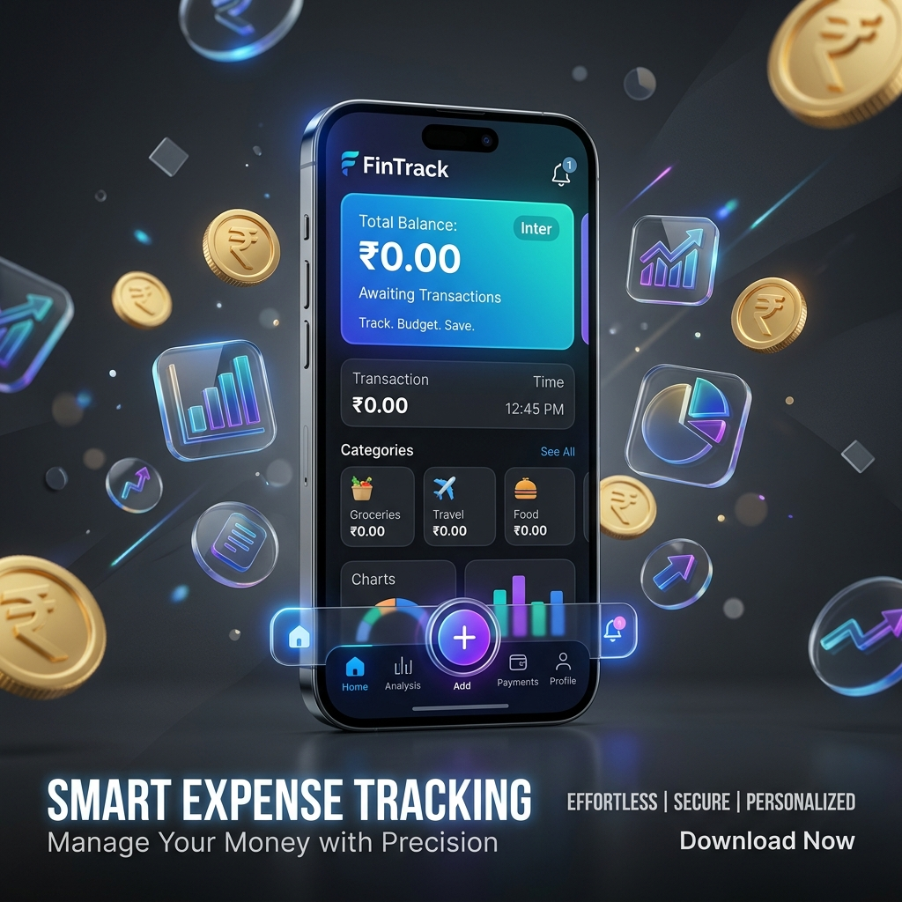

# 💰 Expense Tracker - Premium Financial Management
 


A production-grade, highly interactive, and visually stunning Android application built with **Java** and **Clean Architecture**. This isn't just an expense tracker; it's a premium financial experience featuring glassmorphism design, advanced data visualization, and a custom animation engine.

---

## 🚀 Experience the Premium Feel

### ✨ Key Features

-   **📊 Dynamic Dashboard**: A real-time overview of your finances with an animated balance counter and an interactive, sorted donut chart that breaks down spending by category.
-   **📈 Advanced Analytics**: Visualize your financial health over time with smooth line charts and detailed category insights. Filter by Weekly, Monthly, or Yearly periods.
-   **📂 Professional PDF Export**: Generate beautiful, professional financial reports with one tap. Perfect for tax season or auditing.
-   **💎 Premium UI/UX**: 
    -   **Glassmorphism Effects**: Modern, translucent UI components that feel light and airy.
    -   **Floating Navigation**: A custom-built, floating bottom navigation bar with satisfying bounce animations.
    -   **Dark-First Design**: Optimized for performance and eye comfort with a sleek #0F1115 night-themed aesthetic.
-   **⚡ Custom Animation Engine**: Smooth entrance transitions, scale-bounce interactions, and layout animations that make the app feel alive.
-   **🛡️ Robust Data Management**: Powered by Room Database for offline-first reliability and lightning-fast local performance.

---

## 🛠️ Technical Masterpiece

### 🏗️ Architecture
The app follows **Clean Architecture** principles and the **MVVM** design pattern, ensuring a strict separation of concerns:
-   **Presentation Layer**: Fragments using ViewBinding and ViewModel for lifecycle-aware UI management.
-   **Domain Layer**: Pure business logic with dedicated UseCases.
-   **Data Layer**: Repository pattern managing a Room SQLite database.

### 🧰 Tech Stack
-   **Language**: Java (Modern Android standards)
-   **Database**: Room Persistence Library
-   **Navigation**: Jetpack Navigation Component
-   **Dependency**: Material 3 Design
-   **Charts**: MPAndroidChart (Highly customized)
-   **Animations**: Custom specialized `AnimationUtils` layer

---

## 📁 Project Blueprint

```text
com.expensetracker/
├── presentation/          # View Layer (Fragments, ViewModels)
│   ├── dashboard/         # Main financial hub
│   ├── analytics/         # Data visualization & trends
│   ├── transactions/      # Detailed history & search
│   └── addexpense/        # Fluid input system
├── domain/                # Business Logic (Models, UseCases)
├── data/                  # Data Source (Room, Repositories)
└── core/                  # Engine Room
    ├── animations/        # Custom bounce & slide logic
    ├── export/            # PDF generation logic
    └── utils/             # Formatters, Currency tools
```

---

## 🛠️ Getting Started

### Prerequisites
- Android Studio Iguana or newer
- JDK 17
- Android Device/Emulator (API 24+)

### Quick Setup
1. **Clone & Open**: Sync the project in Android Studio.
2. **Build**: Let Gradle resolve dependencies (MPAndroidChart, Lottie, Room).
3. **Run**: Deploy to your device and experience the smooth 60fps animations.

---

## 🎨 Visual Identity

| Primary | Accent | Background | Card |
| :--- | :--- | :--- | :--- |
|  `#6C63FF` |  `#00C9A7` |  `#0F1115` |  `#1A1D23` |

---

Developed with ❤️ by **Abhinav Chauhan**
